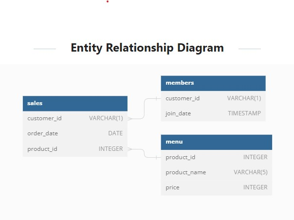

# DANNY’S KITCHEN 
## Introduction 
Danny seriously loves Japanese food so in the beginning of 2021, he decides to embark upon a risky venture and opens up a cute little restaurant that sells his 3 favourite foods: sushi, curry and ramen.
**_Disclaimer:_**  This repository data was gotten Danny's eight weeks Sql challenge with additional personal insight. 
## Problem Statement 
Danny’s Diner is in need of assistance to help the restaurant stay afloat - the restaurant has captured some very basic data from their few months of operation but have no idea how to use their data to help them run the business.
Danny wants to use the data to answer a few simple questions about his customers, especially about their visiting patterns, how much money they’ve spent and also which menu items are their favourite. Having this deeper connection with his customers will help him deliver a better and more personalised experience for his loyal customers.
He plans on using these insights to help him decide whether he should expand the existing customer loyalty program.
Danny has provided a sample of his overall customer data due to privacy issues - but he hopes that these examples are enough for you to write fully functioning SQL queries to help him answer his questions!

## Case Study Questions. 
1.	What is the total amount each customer spent at the restaurant?
2.	How many days has each customer visited the restaurant?
3.	What was the first item from the menu purchased by each customer?
4.	What is the most purchased item on the menu and how many times was it purchased by all customers?
5.	Which item was the most popular for each customer?
6.	Which item was purchased first by the customer after they became a member?
7.	Which item was purchased just before the customer became a member?
8.	What is the total items and amount spent for each member before they became a member?
9.	If each $1 spent equates to 10 points and sushi has a 2x points multiplier - how many points would each customer have?
10.	In the first week after a customer joins the program (including their join date) they earn 2x points on all items, not just sushi - how many points do customer A and B have at the end of January?

## Data Schema
Danny has shared three key datasets for this case study:
- sales
- menu
- members

#### Entity Relationship Diagram
You can inspect the entity relationship diagram and example data below.


## Data Exploration (DML)
1.	What is the total amount each customer spent at the restaurant?
```sql
        SELECT customer_id,
               sum(price) AS Price,
               count(s.product_id) AS No_of_Items
        FROM 
              sales s
                    JOIN
                    menu m ON s.product_id = m.product_id
        GROUP BY customer_id
        ORDER BY customer_id;
``` 
#### output:
 | customer_id | Price  | No_of_Items|
 |:----:|:----:|:----:|
|A	|76 |	6|
|B	|74	|6|
|C	|36	|3|

Customer A, B & C spent 76, 74 and 36 dollars respectively, purchasing 6, 6 and 3 items respectively. 

**2.**	How many days has each customer visited the restaurant?
```sql
        SELECT 		customer_id,
              count(distinct order_date) AS No_of_Days_Visited
        FROM 
              sales s
                    JOIN
                    menu m ON s.product_id = m.product_id
        GROUP BY customer_id;  
```
#### output:
  | customer_id	| No_of_Days_Visited |
  |:----:|:----:|
  |A  |4 |
  |B	|6 |
  |C	|2 |
  
Customer A, B & C visited the restaurant 4, 6, 2 days in total respectively. 

3.	What was the first item from the menu purchased by each customer?
```sql
        SELECT customer_id,
                product_id,
                product_name
        FROM        
                ( SELECT s. customer_id,
                    s.product_id,
                    mn.product_name,
                    s.order_date,
                    dense_rank() OVER (PARTITION BY customer_id ORDER BY order_date asc) As Ranking1 
                FROM 
                    sales s
                JOIN dannys_diner.menu mn
                ON s.product_id = mn.product_id
            ) AS RAN 
        WHERE ranking1 = 1; 	       
```
#### output:
 | customer_id | product_id  | product_name
 |:----:|:----:|:----:|
 |A	  |1	|sushi|
 |A	  |2	|curry|
 |B	  |2	|curry|
 |C	  |3	|ramen|
 |C	  |3	|ramen|
 
Sushi and curry were the first item gotten by customer A, while Customer B got curry and customer C Ramen 

4.	What is the most purchased item on the menu and how many times was it purchased by all customers?
```sql
        SELECT s.product_id,
                mn.product_name,
                (count(s.product_id)) AS No_of_product_sold,
                count(customer_id) No_of_times_purchased
        FROM 
            sales s
        JOIN 	dannys_diner.menu mn
        ON 		s.product_id = mn.product_id
        GROUP BY product_id, product_name;
```
#### output:
| product_id | product_name  | No_of_product_sold | No_of_times_purchased|
|:----:|:----:|:----:|:----:|
|1	|sushi	|3	|3|
|2	|curry	|4	|4|
|3	|ramen	|8	|8|

Ramen is the most purchased item, followed by curry then sushi.	

5.	Which item was the most popular for each customer?
```sql
         SELECT customer_id,
                 product_id,
                product_name,
                No_of_product AS MAX_Item_bought 
         FROM (
               SELECT s. customer_id,
                s.product_id,
                mn.product_name,    
                        COUNT(s.product_id) AS No_of_product,
                dense_rank() OVER (PARTITION BY customer_id ORDER BY COUNT(product_id) DESC) As MAX_RANK 
              FROM 
                sales s 
               JOIN 	menu mn ON	s.product_id = mn.product_id
               GROUP BY customer_id, product_id, product_name) AS cust_BC
         WHERE MAX_RANK = 1 ;
```
#### output:
| customer_id | product_id | product_name  | MAX_Item_bought |
|:----:|:----:|:----:|:----:|
| A	|3	|ramen	|3|
|B	|2	|curry	|2|
|B	|1	|sushi	|2|
|B	|3	|ramen	|2|
|C	|3	|ramen	|3|

Ramen is the most popular item bought by customer A & C, Customer C is indefinite as he purchased equal number of items. 

6.	Which item was purchased first by the customer after they became a member?
```sql
        WITH sales_cte AS (
                            SELECT 
                              s.customer_id,
                              mn.product_name,
                              s.order_date,
                              RANK() OVER( PARTITION BY s.customer_id ORDER BY s.order_date) AS sales_rank
                            FROM dannys_diner.sales s
                            INNER JOIN dannys_diner.members m
                            ON s.customer_id = m.customer_id
                            INNER JOIN dannys_diner.menu mn
                            ON s.product_id = mn.product_id
                            WHERE 
                              s.order_date >= m.join_date 
                            )

        SELECT DISTINCT customer_id,
                        order_date,
                        product_name
        FROM  sales_cte
        WHERE sales_rank = 1;
```
#### output:
 | customer_id | order_date  | product_name|
 |:----:|:----:|:----:|
 | A	|2021-01-07	|curry|
 |B	  |2021-01-11	|sushi|
 
Curry and sushi were the first item purchased by customer A & B respectively after they became a member. 

7.	Which item was purchased just before the customer became a member?
```sql
        WITH sales_cte AS (
                          SELECT 
                              s.customer_id,
                               mn.product_name,
                               s.order_date,
                               RANK() OVER( PARTITION BY s.customer_id ORDER BY s.order_date Desc) AS sales_rank
                          FROM dannys_diner.sales s
                          INNER JOIN dannys_diner.members m
                          ON s.customer_id = m.customer_id
                          INNER JOIN dannys_diner.menu mn
                          ON s.product_id = mn.product_id
                          WHERE 
                            s.order_date < m.join_date 
                          )

        SELECT DISTINCT customer_id,
                        order_date,
                        product_name
        FROM sales_cte
        WHERE sales_rank = 1;
```
#### output:
| customer_id | order_date  | product_name
|:----:|:----:|:----:|
| A	|2021-01-01	|sushi|
|A	|2021-01-01	|curry|
|B	|2021-01-04	|sushi|

Sushi and Curry were the items purchased by Customer A and sushi by customer B just before they became a member.

8.	What is the total items and amount spent by each member before they became a member?
```sql
      SELECT  
             s.customer_id,
             COUNT(s.product_id) AS No_of_Items,
             sum(mn.price)  AS price
      FROM 
          sales s 
          JOIN 
          members b ON s.customer_id = b.customer_id
          join 
          menu mn on mn.product_id = s.product_id
      WHERE order_date < join_date
      GROUP BY customer_id
      ORDER BY customer_id;
```
#### output:
 | customer_id | No_of_Items  | price |
 |:----:|:----:|:----:|
 |A	  |2	|25|
 |B	  |3	|40|
 
Customer A bought two (2) items for twenty (20) dollars while customer B bought three (3) items for forty (40) dollars before they became a member. 
```sql 
        SELECT s.customer_id,
                COUNT(s.product_id) AS No_of_Items,
                sum(mn.price)  AS price
        FROM 
                sales s 
        JOIN 
                members b ON s.customer_id = b.customer_id
        join 
                menu mn on mn.product_id = s.product_id
        WHERE   order_date >= join_date
        GROUP   BY customer_id
        ORDER   BY customer_id;
```
#### output:
 | customer_id | No_of_Items  | price |
 |:----:|:----:|:----:|
|A	|4	|51|
|B	|3	|34|

Customer A bought four (4) items for fifty-one (51) dollars while customer B bought three (3) items for thirty-four (34) dollars after they became a member. 

9.	If each $1 spent equates to 10 points and sushi has a 2x points multiplier - how many points would each customer have?
```sql
        with cte as (
                    SELECT 	s.customer_id, 
                            m.product_name,
                            m.price, 
                            case when product_name = 'sushi' then 20*price
                            else 10*price
                            end as points  
                    FROM 
                      sales s 
                        join 
                      menu m on m.product_id = s.product_id
          )
        SELECT 	customer_id,
                sum(points) AS total_point 
        FROM cte 
        GROUP BY customer_id;    
```
#### output:
 | customer_id | total_pointe | 
 |:----:|:----:|
 |A	  |860|
 |B	  |940|
 |C	  |360|
 
Customer A, B & C has 860, 940 and 360 points respectively. 

10.	In the first week after a customer joins the program (including their join date) they earn 2x points on all items, not just sushi - how many points do customer A and B have at the end of January?
```sql
         WITH CTE2 AS (
                        SELECT 	s.customer_id, 
                                m.product_name,
                                order_date,
                                m.price, 
                                case when order_date = join_date then 20*price 
                                when order_date between join_date and join_date + 6 then 20*price 
                                when product_name = 'sushi' then 20*price
                                else 10*price
                                end as pointy 
                        FROM 
                          sales s 
                            join 
                          menu m on m.product_id = s.product_id
                            JOIN 
                          members b ON s.customer_id = b.customer_id
                            ORDER BY order_date)

      SELECT customer_id,
            SUM(pointy) AS total_jan_point 
      FROM CTE2 
      WHERE MONTH(order_date) = 01
      GROUP BY customer_id
      ORDER BY customer_id;
```
#### output:
 | customer_id | total_jan_point |
 |:----:|:----:|
 |A	  |1370|
 |B	  |820|
 
At the end of January customer, A & B has 1370 and 820 points respectively.

To get more insight on the data we also to know how many and what product was gotten by the customers before and after they became a member. 
```sql
-- 11 how many and what product was gotten by each customer before they became a member 
WITH sales_cte2 AS (
                SELECT 
                          s.customer_id,
                          mn.product_name,
                          s.order_date,
                          mn.price,
                          RANK() OVER( PARTITION BY s.customer_id ORDER BY mn.product_name) AS sales_rank
                FROM    dannys_diner.sales s
                INNER JOIN dannys_diner.members m
                ON s.customer_id = m.customer_id
                INNER JOIN dannys_diner.menu mn
                ON s.product_id = mn.product_id
                WHERE 
                  s.order_date < m.join_date 
                )

SELECT  product_name,
        count(sales_rank) AS No_items_sold,
        sum(price)
FROM sales_cte2
GROUP BY  product_name; 

-- 12 how many and what product was gotten by each customer after they became a member 
WITH sales_cte2 AS (
                SELECT 
                          s.customer_id,
                          mn.product_name,
                          s.order_date,
                          mn.price,
                          RANK() OVER( PARTITION BY s.customer_id ORDER BY mn.product_name) AS sales_rank
                FROM dannys_diner.sales s
                INNER JOIN dannys_diner.members m
                ON s.customer_id = m.customer_id
                INNER JOIN dannys_diner.menu mn
                ON s.product_id = mn.product_id
                WHERE 
                  s.order_date >= m.join_date 
                )

SELECT  product_name,
        count(sales_rank) AS No_items_sold,
        sum(price) AS price
FROM sales_cte2
GROUP BY  product_name;
```
#### Before output:
 | product_name | No_items_sold  |price |
 |:----:|:----:|:----:|
 |curry	|3	|45|
 |sushi	|2	|20|

#### After output:
 | product_name | No_items_sold  |price |
 |:----:|:----:|:----:|
 |curry	 |1	|15|
 |ramen	 |5	|60|
 |sushi	 |1	|10|
 
Only two products (sushi and curry) were gotten by the customers before they became a member, while all product were purchased by the customers after they became a member with ramen been the highest. 

The below query shows the difference between the number of days of visit. 
```sql
        SELECT 
                  s.customer_id,
                  mn.product_name,
                  s.order_date,
                  DENSE_RANK() OVER( PARTITION BY s.customer_id ORDER BY S.order_date) AS sales_rank,
                  day(order_date) - DAY((LAG(order_date) OVER( PARTITION BY s.customer_id ORDER BY S.order_date))) AS Daydiff
        FROM dannys_diner.sales s
        INNER JOIN dannys_diner.menu mn
        ON s.product_id = mn.product_id; 
``      
#### Output:
| customer_id | product_name  |order_date |sales_rank | Daydiff
 |:----:|:----:|:----:|:----:|:----:|
|A	|sushi	|2021-01-01	|1	| |
|A	|curry	|2021-01-01	|1	|0 |
|A	||curry	|2021-01-07	|2	|6 | 
|A	|ramen	|2021-01-10	|3	|3 |
|A	|ramen	|2021-01-11	|4	||1 |
|A	|ramen	|2021-01-11	|4	|0 |
|B	|curry	|2021-01-01	|1	| |
|B	|curry	||2021-01-02	|2	|1 |
|B	|sushi	|2021-01-04	|3	|2 |
|B	|sushi	|2021-01-11	|4	|7 |
|B	|ramen	|2021-01-16	|5	|5 |
|B	|ramen	|2021-02-01	|6	||-15 |
|C	|ramen	|2021-01-01	|1	| |
|C	|ramen	|2021-01-01	|1	|0 |
|C	|ramen	|2021-01-07	|2	|6 |
 
## Observation 
Fithen (15) samples of Dannys’ Diner customers sales transaction within the period of one month (1st January- 1st February) was given. The following was deduced from the data given; 

- Customer A & B are members of the customer loyalty program.
- Customer A generate the highest income followed by customer B while Customer C generates about half of that which was gotten from the other customer(A&B)
- Customer B visits the restaurant more often
- Customer A &B both purchased all the three types of products available (Sushi, Curry & Ramen) while Customer C only purchased Ramen. 
- Only two products (sushi and curry) were gotten by the customers before they became a member, while all product were purchased by the customers after they became a member with ramen been the highest. 

## Conclusion
customer loyalty program enhanced the sales rate of the kitchen as the highest sales were made after customer became member. 
